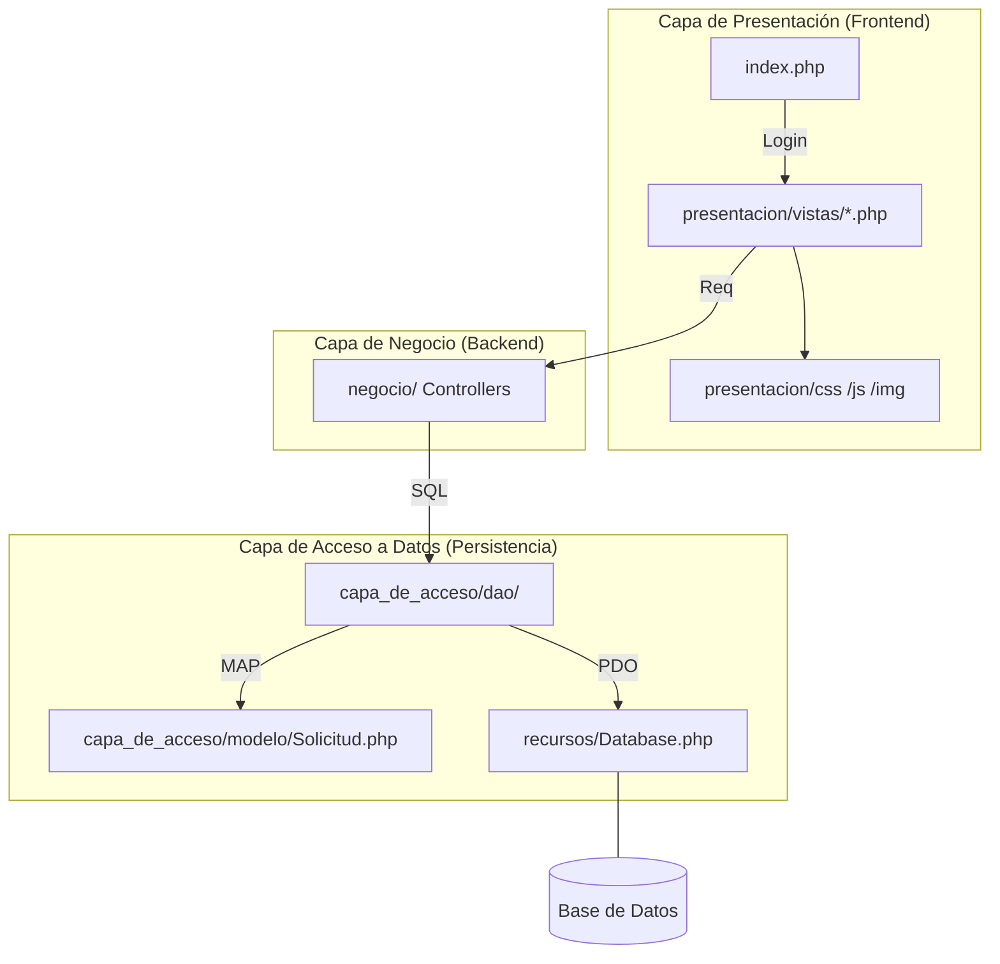

# Proyecto CECAR: Sistema de Solicitudes

Este proyecto es un sistema de gestión de solicitudes desarrollado en PHP con una arquitectura multicapa.

## 🏗️ Estructura del Sistema (Organizado)

El siguiente diagrama representa la nueva organización del proyecto:

### 📂 Desglose de Carpetas

- **`presentacion/vistas/`**: Todas las páginas del sistema (Dashboard, Solicitudes, etc.).
- **`presentacion/css/estilos.css`**: Estilos procesados.
- **`presentacion/js/solicitudes.js`**: Lógica de cliente.
- **`negocio/`**: Controladores que manejan la lógica principal.
- **`capa_de_acceso/`**: Gestión de persistencia (DAO y Modelo).
- **`recursos/`**: Clases de utilidad (Conexión BD, Autenticación).
- **`uploads/`**: Directorio de archivos subidos.

## 🚀 Configuración
1. Clonar el repositorio en `htdocs` de XAMPP.
2. Configurar la base de datos en `recursos/Database.php`.
3. El esquema de la base de datos se encuentra en `database.sql`.
